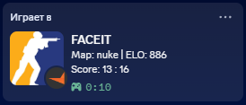

# FACEIT Discord Rich Presence for CS2


Shows your live FACEIT CS2 match — map, ELO, score and elapsed time — in your
Discord Rich Presence. Fully out-of-process: a browser extension reads the
public FACEIT match page DOM and forwards a JSON snapshot to a local Go daemon,
which talks to Discord over IPC. **No memory reading, no process injection, no
OCR** — 100% isolated from FACEIT Anti-Cheat.

## Screenshot



## Features

- Live map, your ELO, team score and an elapsed-match timer in Discord.
- Works on Chromium (Chrome / Edge / Brave / Yandex) and Gecko (Firefox / Zen).
- Local-only: the daemon binds `127.0.0.1` and rejects non-loopback / non-extension requests.
- Single-instance (a Windows mutex prevents double launches).
- No background "phone home" — only talks to Discord and your own browser.

## How it works

```
FACEIT match page (DOM)
   |  content.js reads map / ELO / score
   v
background.js  --HTTP POST-->  Go daemon (127.0.0.1:42157/api/state)
                                   |  validates + keeps one Discord IPC connection
                                   v
                                Discord Rich Presence
```

- **Extension** (`extensions/chromium` + `extensions/gecko`) scrapes the public
  FACEIT DOM and POSTs a snapshot to `http://127.0.0.1:42157/api/state`.
- **Daemon** (`bin/faceit-rpc.exe`) validates the payload, maintains a single
  Discord IPC connection with auto-reconnect, and renders the presence.

## Discord Developer Portal (one-time)

1. Open https://discord.com/developers/applications and create a **New Application**.
2. The **Application ID** is already set in `backend/main.go`
   (`1540354848015388685`) — you normally don't need to change it.
3. Go to **Rich Presence → Artwork Assets** and upload two images:
   - key `cs2`   — the CS2 game icon (used as the **large** image)
   - key `faciet` — the FACEIT logo (used as the **small** image)
4. Keep the Discord desktop app running and signed in.

> The two asset keys must be exactly `cs2` and `faciet` (that is `faciet`, not `faceit`).

## Build from source

Requires **Go 1.22+**. UPX is optional.

```bash
make build     # build bin/faceit-rpc.exe
make xpi       # build dist/faceit-rpc.xpi (Firefox/Zen extension)
make dist      # build everything + dist/faceit-rpc-win.zip (user bundle)
make run       # run the daemon from source (development)
```

Or use the helper scripts directly:

```bat
install\pack_firefox.bat   # build the .xpi only
install\pack_dist.bat      # build the full Windows bundle
```

The port can be overridden with the `CS2RPC_PORT` environment variable (must
match the `PORT` constant in the extension if you change it).

## Installation

### English

**A. For users — download the bundle (recommended)**

1. Go to **GitHub Releases** and download `faceit-rpc-win.zip`.
2. Extract it.
3. Double-click **`start_daemon.bat`** and keep its window open.
4. Install the browser extension:
   - **Chromium** (Chrome / Edge / Brave / Yandex): open `chrome://extensions`,
     enable **Developer mode**, click **Load unpacked** and select the
     `extensions/chromium` folder from the extracted archive.
   - **Firefox / Zen**: open `about:config` and set
     `xpinstall.signatures.required` to `false` (one time only). Then open
     `about:addons` → gear menu → **Install Add-on From File** → choose
     `faceit-rpc.xpi` from the archive.
5. Click the toolbar icon, enter your **FACEIT nickname**, and press **Save**
   (required so your own ELO is detected).
6. Open a FACEIT match room — the presence appears in Discord within ~1 second.

**B. For developers — build from source**

Follow the [Build from source](#build-from-source) section, then run
`bin/faceit-rpc.exe` (or `make run`) and load the extension from
`extensions/chromium` (Chromium) or `extensions/gecko` (Firefox, after packing
to `.xpi` with `make xpi`).

## Русское руководство (установка)

Показывает твой живой матч FACEIT CS2 (карта, ELO, счёт и таймер) в Discord
Rich Presence. Без чтения памяти и процессов — 100% безопасно для FACEIT
Anti-Cheat. Ниже — шаги установки и запуска на русском.

**Способ А. Скачать готовый бандл (для обычных пользователей)**

1. Перейди в GitHub Releases и скачай `faceit-rpc-win.zip`.
2. Распакуй архив.
3. Запусти `start_daemon.bat` (окно держи открытым).
4. Установи расширение для браузера:
   - Chromium (Chrome/Edge/Brave/Yandex): открой `chrome://extensions`, включи «Режим разработчика», нажми «Load unpacked» и выбери папку `extensions/chromium` из архива.
   - Firefox / Zen: открой `about:config` и установи `xpinstall.signatures.required` = `false` (один раз). Затем открой `about:addons` -> меню-шестерёнка -> Install Add-on From File -> выбери `faceit-rpc.xpi` из архива.
5. Нажми иконку на панели, введи свой FACEIT-никнейм и нажми Save (нужно для определения твоего ELO).
6. Открой матч-руму FACEIT — статус появится в Discord через ~1 секунду.

**Способ Б. Сборка из исходников**

Требуется Go 1.22+. Полезные команды:
- `make build` — собрать `bin/faceit-rpc.exe`.
- `make xpi` — собрать `dist/faceit-rpc.xpi`.
- `make dist` — собрать всё и упаковать бандл `dist/faceit-rpc-win.zip`.

**Один раз: Discord Developer Portal**
1. Открой https://discord.com/developers/applications -> New Application.
2. Application ID уже прописан в `backend/main.go` (`1540354848015388685`).
3. Rich Presence -> Artwork Assets: загрузи две картинки: ключ `cs2` (иконка CS2, большая) и ключ `faciet` (логотип FACEIT, маленькая). Внимание: ключ `faciet`, а не `faceit`.
4. Держи десктоп-клиент Discord запущенным и авторизованным.

## Usage

1. Start the daemon: `bin/faceit-rpc.exe` (logs to `cs2rpc.log` next to it).
2. Install the extension for your browser.
3. Open a FACEIT match room. Discord shows the live presence within ~1s.
4. Closing the match tab or leaving the match clears the presence.

## Configuration

| Setting        | Default / env            | Notes                                  |
|----------------|--------------------------|----------------------------------------|
| App ID         | `1540354848015388685`    | set in `backend/main.go`               |
| Port           | `42157` / `CS2RPC_PORT`  | daemon binds `127.0.0.1:<port>`        |
| Discord assets | `cs2`, `faciet`          | uploaded in the Developer Portal       |
| Nickname       | popup input              | stored in `chrome.storage.local`       |

## Troubleshooting / notes

- **No presence?** Make sure the Discord desktop client is running and that you
  uploaded the `cs2` and `faciet` assets in the Developer Portal.
- **Score/map stops updating after a FACEIT site redesign?** The selectors in
  `extensions/*/content.js` are best-effort; adjust them there.
- **Firefox: "xpi not signed"?** Set `xpinstall.signatures.required=false` in
  `about:config` (or sign via AMO). This is only needed for the packaged `.xpi`;
  Chromium's Load unpacked needs no signing.
- The daemon rejects any request whose `Host` is not loopback or whose `Origin`
  is not the extension (DNS-rebinding / cross-site protection).
- Single-instance: launching the exe twice is ignored via a Windows named mutex.

## Disclaimer

This project does not interact with the FACEIT client or game process in any
way. It only reads the public FACEIT web page DOM in your browser and talks to
Discord. Use at your own risk.
